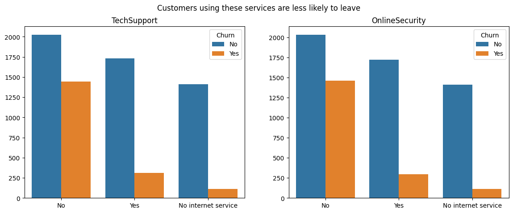

### Negative correlation
1. Contract (-0.396713) - Contract type. A large negative correlation indicates a strong influence of this feature on the decrease in outflow. Clients with long-term contracts are less likely to leave.

2. tenure (-0.352229) - Customer service period. This feature also has a significant impact. Customers with a longer service life are less likely to leave.

3. TechSupport (-0.282492) and OnlineSecurity (-0.289309) - Availability of technical support and online security. Both signs have a strong negative impact on customer care. Customers using these services are less likely to leave.

4. Dependents (-0.164221) - Availability of dependents. This sign also affects the departure of customers, but to a lesser extent.
### Positive correlation
1. MonthlyCharges (0.193356) - Monthly payments. A positive correlation means that customers with higher monthly payments are more likely to leave. This may be due to high tariffs or additional services that customers may consider unnecessary.

2. PaperlessBilling (0.191825) - Paperless billing. A positive correlation indicates that customers using paperless billing are more likely to leave. This may be due to the level of customer satisfaction with this payment method or other factors.

3. SeniorCitizen (0.150889) - Senior citizen. A positive correlation indicates that older citizens may be more inclined to leave. This may be due to changes in their consumer needs or other factors.

4. PaymentMethod (0.107062) - Payment method. A positive correlation indicates that some payment methods may be associated with a higher level of customer churn. This may be related to certain aspects of the payment terms.

